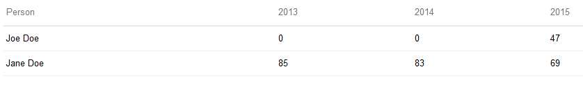
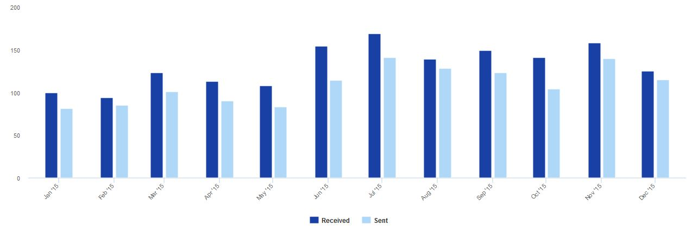

# Extra Widgets for Polarion® ALM™

Copyright 2016 Polarion AG

This Polarion® ALM™ extension contains several extra widgets usable in LiveReport Pages.

## Requirements

- Polarion® ALM™ 2015 or newer

## Installation

1. Download packaged extension from http://extensions.polarion.com/extensions/292-extra-widgets-for-polarion-alm
2. Stop Polarion server.
3. Extract `com.polarion.alm.extensions.widgets.zip` into `<Polarion Installation>/polarion/extensions`.
4. Start Polarion server.

## Usage

All widgets are available in the Widgets sidebar of LiveReport Page's Edit mode.

## CSV-based Widgets

CSV-based widgets visualize CSV files stored in the main Subversion repository.

CSV file format used by these widgets:
- is plain text encoded in UTF-8,
- consists of records with one record per line,
- where first record is always header,
- with the records divided into fields separated by configurable delimiter (comma by default).

### CSV-based Table Widget

Table widget visualizes CSV file as simple table with header:

Example CSV file named `table_example.csv` is in the `docs` folder. It is derived from real report of the number of days spent on an activity in various years.

#### Parameters

- *Data Source*
  - *Data Location*: path within main Subversion repository (e.g. `/TestProject/.polarion/reports/table_example.csv`)
  - *Field Separator*: CSV field separator

### CSV-based Trend Chart Widget

Trend chart widget visualizes one or multiple CSV files as trend chart:

The first field of all CSV records must be date formatted as `yyyy-MM-dd`, other fields must be integers. The file does not have to be sorted and there might be gaps in dates.

Example CSV file named `chart_example.csv` is in the `docs` folder. It is derived from real report of the number of sent and received mails to a shared mailbox.

#### Parameters

- *Title*: chart title (can be empty)
- *Data Source*
  - *Data Location*: path within main Subversion repository (e.g. `/TestProject/.polarion/reports/chart_example.csv`)
  - *Field Separator*: CSV field separator
- *Additional Data Sources*
  - *Data Source*
    - *Name*: data source name
    - for the rest see main *Data Source* definition above
- *Data Visualization*
  - *Series*
    - *Name*: name (visible in the chart)
    - *Color*: color (in HTML/CSS format)
    - *Data Key*: field name (from CSV file header), for additional data source prepend its name followed by dot (e.g. `Mailbox.Received`)
    - *Aggregation*: one of `sum`, `first`, `last`, `min`, `max` (see Explanation of Aggregation)
    - *Type*: series type or leave empty for widget default (see *Type* below)
- *Dates*
  - *From*: start of the visible interval
  - *To*: end of the visible interval
  - *Scale*: one of `day`, `week`, `month`, `year`
  - *Year*: will override *From* and *To* parameters when used so that whole year is visible  
- *Type*: default series type, one of `bar`, `column`, `line`, `spline`
- *Text Above*: text written above the chart (see Text Processing for more information)
- *Text Below*: text written below the chart (see Text Processing for more information)
- *Date Format*: date format used in *Text Above* and *Text Below*

#### Explanation of Aggregation
 
If *Scale* is set to something else than `day` then it is necessary to choose one integer to represent all values from the scaled interval. Possible algorithms are:
- `sum`: all values are summed up
- `first`: first recorded value is taken 
- `last`: last recorded value is taken
- `min`: minimum of all values is taken
- `max`: maximum of all values is taken

#### Text Processing

*Text Above* and *Text Below* may contain special sequences:
- `${_workingDays}`: number of working days in the visible interval (based on default Polarion calendar)
- `${`*Data Key*`}`: sum of all values for given data key in the visible interval (e.g. `${Mailbox.Received}`)
- `${`*Data Key*`PerDay}`: sum of all values for given data key in the visible interval divided by number of working days (e.g. `${Mailbox.ReceivedPerDay}`)
- `${_timestamp}`: last modified time of the main CSV file
- `${_timestamp`*Data Source Name*`}`: last modified time of the given additional CSV file (e.g. `${_timestampMailbox}`)

## Source code

Download sources from GitHub: https://github.com/Polarion/com.polarion.alm.extensions.widgets
